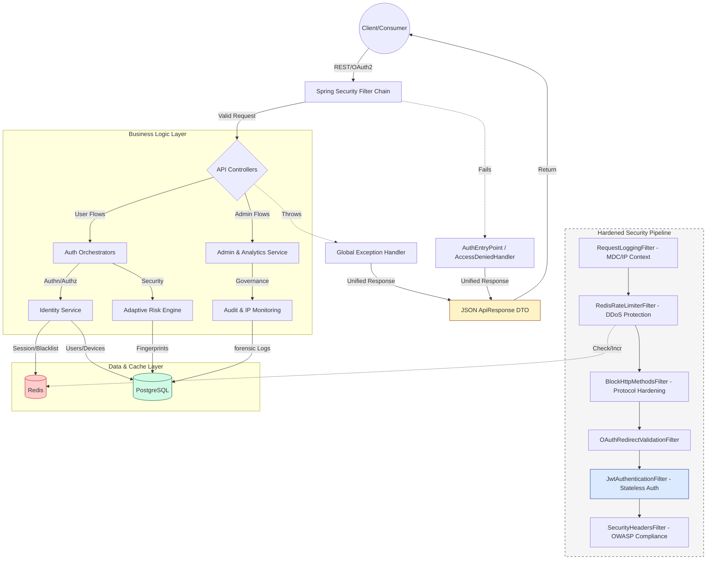

# 🛡️ Advanced Authentication & Security System


> **An enterprise-grade, high-security authentication platform engineered for scale, compliance, and resilience.**

---

## 🚀 Live Demo & Documentation
**Interactive API Docs (Swagger UI):**
👉 **[https://prasad-auth-sys.duckdns.org/swagger-ui/index.html](https://prasad-auth-sys.duckdns.org/swagger-ui/index.html)**

### ⚡ Architectural Decision: Headless API
This system utilizes an **API-First Architecture** via Swagger UI to ensure absolute security transparency.
* **No UI Obfuscation:** Unlike traditional frontends that hide complexity, this exposes the raw API contract.
* **Security Validation:** Reviewers can directly inspect critical headers (HSTS, CSP), HttpOnly cookies, and JWT payloads.
* **Integration Ready:** The provided OpenAPI spec allows for immediate client generation in any language.

---

## 📖 Project Overview
This is **not just a login form**. It is a **hardened security framework** designed to mitigate OWASP Top 10 vulnerabilities. It features a custom-built stateless architecture using JWTs, aggressive Redis-backed rate limiting, and adaptive risk analysis based on geolocation and device fingerprinting.

### **Core Problem Solved**
Most auth systems fail under load or succumb to credential stuffing. This system implements **Defense-in-Depth**:
1.  **Layer 1 (Network):** Nginx & Redis Rate Limiting (DDoS protection).
2.  **Layer 2 (Identity):** Stateless JWT with rotation & blacklisting.
3.  **Layer 3 (Behavior):** IP & Device tracking to detect anomalies.

---

## 🏗️ System Architecture


## 🛡️ Key Security Features

### 🔐 Authentication & Authorization
* **Stateless JWT:** Signed using RS256 (Private/Public Key Pair).
* **Token Rotation:** Refresh tokens with reuse detection (prevents replay attacks).
* **RBAC (Role-Based Access Control):** Granular permissions for `USER`, `ADMIN`, and `SUPER_ADMIN`.
* **MFA (Multi-Factor Authentication):** Time-based OTP (TOTP) and Email-based verification.

### 🚫 Threat Mitigation
* **Rate Limiting (Redis + Bucket4j):**
    * *Public API:* 100 req/min
    * *Auth Endpoints:* 5 req/min (Brute-force protection)
* **Geo-Fencing:** Integration with **MaxMind GeoLite2** to detect impossible travel and suspicious logins.
* **Device Fingerprinting:** Tracks User-Agent and Client Hints to identify new/suspicious devices.

### ⚡ Performance Engineering
* **Redis Caching:** Distributed caching for user sessions and blacklisted tokens.
* **Async Processing:** Email sending and audit logging offloaded to virtual threads to prevent blocking.
* **Database Optimization:** Indexed columns for high-frequency queries (email, username).

---

## 🛠️ Tech Stack

| Component | Technology | Description |
| :--- | :--- | :--- |
| **Language** | Java 17 | Core logic and concurrency |
| **Framework** | Spring Boot 3.2 | Web MVC, DI, AOP |
| **Security** | Spring Security 6 | Filter chains, OAuth2 Resource Server |
| **Database** | PostgreSQL 15 | Relational data & JSONB support |
| **Cache** | Redis | Rate limiting buckets & Token blacklist |
| **Validation** | Hibernate Validator | JSR-380 Request DTO validation |
| **Deployment** | AWS EC2 (Linux) | Production environment |
| **Proxy** | Nginx | Reverse proxy, SSL termination, Load balancing |

---

## ⚙️ Local Setup & Installation

**Prerequisites:**
* Java 17+
* PostgreSQL running on port `5432`
* Redis running on port `6379`

### 1. Clone the Repository
```bash
git clone [https://github.com/YOUR_USERNAME/Advanced-Authentication-System.git](https://github.com/YOUR_USERNAME/Advanced-Authentication-System.git)
cd Advanced-Authentication-System
```
### 2. Configure Environment
* Update src/main/resources/application.properties with your database credentials:
* spring.datasource.url=jdbc:postgresql://localhost:5432/advanced_auth
* spring.datasource.username=postgres
* spring.datasource.password=your_password

### 3. Build and Run
* ./mvnw clean install
* ./mvnw spring-boot:run

### 4. Access the Application
* Swagger UI: http://localhost:8080/swagger-ui/index.html

---

## 👨💻 Author
* Name: Prasad Mhaskar
* Role: Backend Engineer | Java & Cloud Specialist
* Focus: Building scalable, secure distributed systems.
* LinkedIn: [https://www.linkedin.com/in/prasad-mhaskar/]


